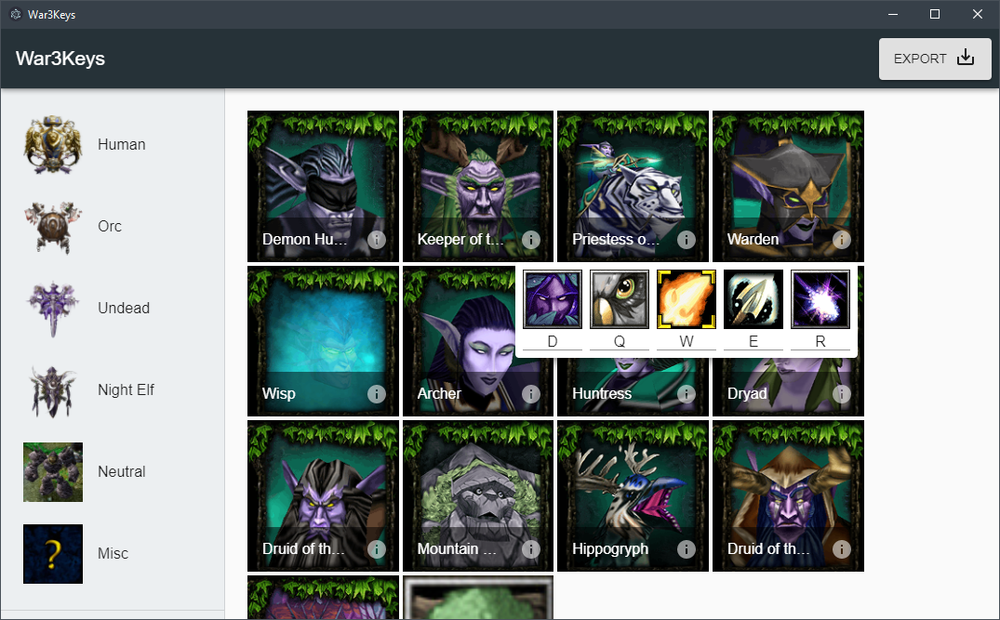

<div align="center">
    <h1>
      War3Keys
    </h1>
    
</div>

War3Keys is an Electron application that allows you to set *custom* hotkeys in [Warcraft III: The Frozen Throne](https://en.wikipedia.org/wiki/Warcraft_III:_The_Frozen_Throne) without having to manually edit the `CustomKeys.txt` file.

## Motivation
Having hotkeys on the left side of the keyboard is a necessity for any *real-time strategy* game. When [Blizzard](https://en.wikipedia.org/wiki/Blizzard_Entertainment) made Warcraft III back in the early 2000s, they did not consider this and place their hotkeys all over the keyboard.

Only recently has Blizzard put in native support for custom hotkeys without having users to rely on third-party software through a `CustomKeys.txt` file. However, this is a really cumbersome approach to set hotkeys because its literally just editing a plain text file.

Example:
```
[anfa]
Tip=(|cffffcc00W|r) Frost Arrows - [|cffffcc00Level 1|r],(|cffffcc00W|r) Frost Arrows - [|cffffcc00Level 2|r],(|cffffcc00W|r) Frost Arrows - [|cffffcc00Level 3|r]
UnTip=|cffc3dbffRight-click to activate auto-casting.|r
Researchtip=(|cffffcc00W|r) Learn Frost Arrows - [|cffffcc00Level %d|r]
Hotkey=W
Researchhotkey=W
Buttonpos=1,0
Unbuttonpos=1,0
Researchbuttonpos=1,0
```

There are a number of problems with this. Namely, its not user friendly, its a one massive file (1000+ lines), and if you are a [professional gamer](https://en.wikipedia.org/wiki/List_of_eSports_players) then you are going to have to bring this file with you to every tournament. Not the best solution!

War3Keys solves all these problems by giving users a graphical interface to set custom hotkeys while also syncing them to the cloud.

## Releases
You can find the latest release on the [releases](https://github.com/drdgvhbh/War3Keys/releases) tab. This application supports Windows, Linux, and Mac.

## Usage

1. Install and application and launch it
2. Wait for it to load. A small loading window should popup
3. Create an account and login
4. Use any of the side menus to select a race and click on the *info* icon to set a hotkey
5. Click *Export* in the top right when you are done and save it in your *Warcraft III* application data folder under `Warcraft III\CustomKeyBindings`
